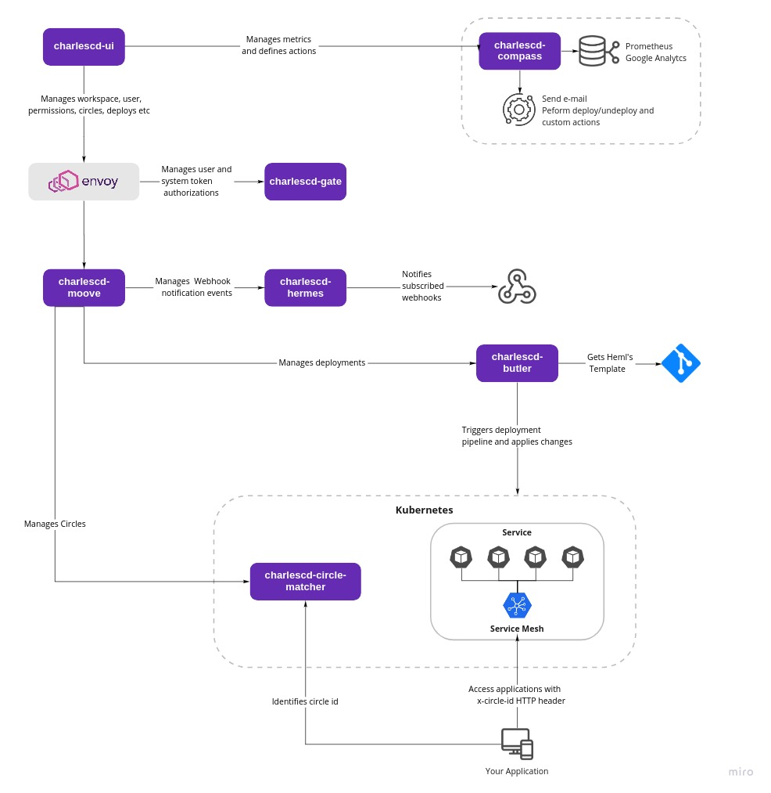

# Overview

## What is Charles?

CharlesCD is an open-source tool that makes deployments more agile, continuous, and safe, which allows development teams to perform hypothesis validations with a specific group of users, simultaneously.


The product brings a new concept to the community: **the** **deployment in circles of users on Kubernetes clusters**.


This kind of deployment makes it possible to create a segment with your clients' specific characteristics and, at the same time, submit several versions of the same application to test this circle of users.

## How was the project created?

Charles was created to offer a more efficient solution for the community to create deployments and test hypotheses together, which allows the identification of errors and the execution of possible solutions to solve bugs faster.

The concept behind the tool goes back to the theory proposed by the biologist Charles Darwin \(1809-1882\), in which evolution goes by the adaptation to a new environment. In the development scenario, this evolution goes by constant improvements on the applications to build and test hypothesis in order to implement more reliable releases.

For this reason, we believe CharlesCD is the darwinism's application inside the development and programming world.

## What does Charles do?

The methodology implemented by Charles brings a lot of advantages such as:

* Simple segmentation of users based on their profiles or demographic data; 
* Easy and sophisticated creation of implementation strategies using circles;  
* Easy version management, allowing multiple parallel releases of the same application in the production environment; 
* Monitoring the impact of each version through predefined metrics during the implementation creation.

  \*\*\*\*

## Requirements

In order to user Charles, it is necessary to fulfill some requirements: 

1. **Installation:** see what you need ****[**here**](get-started/installing-charles/#requirements).
2. To make the tool work properly, you will need: ****

* A [**Registry**](get-started/defining-a-workspace/docker-registry.md) where the images of your application are stored.
* Define a **CI flow.** It is expected that this flow is active through a trigger, for example, a branch name that has a defined prefix. Besides that, the pipeline must build the application's image and upload it to the registry mentioned before. 
* Prepare the [**Helm template**](get-started/creating-your-first-module/how-to-configure-chart-template.md#what-is-helm) ****of your applications. This is important, a configured CD through Charles will need this information to make the deployments of your application. 

## **System architecture**

The platform was built using a microservice approach, and it has the following modules:

* `charlescd-ui:`  mirrors on the front-end the workspace configuration, users, modules, hypothesis, and boards. It is the platform graphical interface.  
* `charles-moove:` manages workspaces, users, modules, hypothesis, and boards. It is the whole platform structure.   
* `charles-butler:` orchestrates and manages releases and deploys. 
* `charles-circle-matcher:`manages all created circles, and points out which circle each user belongs to, based on their characteristics. 
* `charlescd-compass`: data providers integration, make metrics analysis and execute configurable actions.
* `charlescd-hermes`: notifies external services previously subscribed of deploy and undeploy events.  
* `charlescd-gate`: control users' permissions according to the resources available in Charles' APIs.

