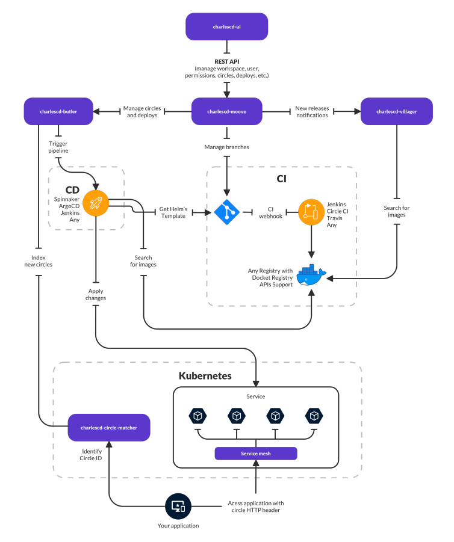

# Overview

## O que é o Charles?

O Charles é uma ferramenta open source que realiza deploys de forma ágil, contínua e segura, permitindo que as equipes de desenvolvimento realizem simultaneamente validações de hipóteses com grupos específicos de usuários. 


O produto traz um conceito pioneiro no mercado e na comunidade: **deploys em círculos de usuários em clusters de Kubernetes.** 


Neste modelo de deploy, é possível **segmentar seus clientes através de características específicas** e, ao mesmo tempo, submeter diversas versões de uma mesma aplicação para teste com os usuários dos círculos. 

## Como nasceu o produto?

O Charles surgiu da necessidade de oferecer para a comunidade uma solução mais eficaz no trabalho de fazer deploys e testar hipóteses simultaneamente, permitindo mais rapidez na identificação de erros e execução de possíveis soluções para resolver os bugs. 

O conceito por trás da ferramenta remete à teoria proposta pelo biólogo _Charles Darwin_ \(1809-1882\), ou seja, a de que a evolução se dá pela adaptação a um novo ambiente. No caso do desenvolvimento, essa evolução se dá através de constantes melhorias nas aplicações ao construir e testar hipóteses de maneira a implantar as releases mais precisas e eficazes. 

Por esse motivo, consideramos que o Charles é a aplicação do _darwinismo_ dentro do universo de desenvolvimento e programação.

## O que o Charles faz?

A metodologia implementada pelo Charles traz várias vantagens, como:

* Simples segmentação de usuários com base em seu perfil ou até mesmo dados demográficos;
* Criação de estratégias de implantação de maneira mais fácil e sofisticada utilizando os círculos;
* Fácil gerenciamento de versões em caso de múltiplas releases em paralelo no ambiente produtivo;
* Monitoramento dos impactos de cada versão através de métricas definidas durante a criação da implantação.

## Requisitos

Antes de instalar ou usar o Charles, é preciso cumprir alguns pré-requisitos:

1. **Instalação:** veja o que é necessário [**aqui**](primeiros-passos/instalando-charles.md#pre-requisitos).
2. Para o funcionamento completo da ferramenta é preciso:

* Possuir um [**Registry**](primeiros-passos/definindo-workspace/docker-registry.md) onde as imagens das suas aplicações são armazenadas.
* Definir um **fluxo de CI**. É esperado que esse fluxo seja ativado por meio de algum gatilho, por exemplo, um nome de branch que tenha um prefixo definido. Além disso, o pipeline deve realizar a construção da imagem da aplicação e o envio da mesma para o registry citado anteriormente.
* Elaborar o [**Helm template**](primeiros-passos/criando-modulos/configurando-o-chart-template.md#o-que-e-o-helm) ****das suas aplicações. Isso é importante, porque o CD configurado por meio do Charles necessitará dessa informação para realizar o deploy da sua aplicação.

## Arquitetura do sistema

A plataforma foi construída utilizando a abordagem de microsserviços e possui os seguintes módulos:

* `charlescd-ui:` responsável por prover uma interface de fácil usabilidade para todas as features fornecida pelo CharlesCD, no intuito de simplificar testes de hipóteses e _circle deployment_.

* `charlescd-moove:` é um serviço backend que orquestra os testes de hipóteses de seus produtos e o pipeline de entrega até atingir seus círculos, facilitando a ponte entre **Butler**, **Villager** e **Circle Matcher**.  
* `charlescd-butler:` responsável por orquestrar e gerenciar as releases e deploys realizados. 
* `charlescd-circle-matcher:`gerencia todos os círculos criados, além de indicar a qual círculo um usuário pertence, com base em um conjunto de características.

