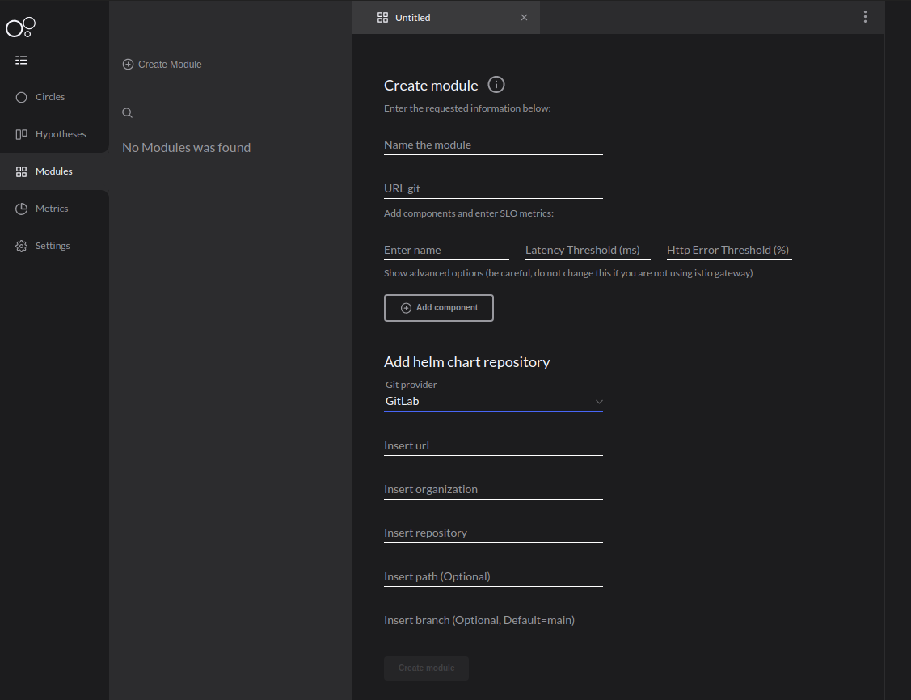

# Creating your first module

After creating and configuring your workspace, it is necessary to add the modules.

A **module** is your application stored in a [**Git repository previously registered**](https://docs.charlescd.io/get-started/defining-a-workspace).

## How to create your modules?

To add it, access the **Modules** menu on your **workspace** and set the following properties:

1. **Name**: This field should be the junction of the organization and the module names, as it is in your git. For example: `ZupIt/charlescd`.
2. **URL Git**: Your repository's URL. For example [https://github.com/ZupIT/charlescd](https://github.com/ZupIT/charlescd).
3.  If you have a lot of applications on your repository, register them with the components and add the following:

* **Name of the component**: application's name, the same on your repository;
* **Metrics**: 

  * **Latency Threshold:** latency \(ms\);
  * **HTTP Error Threshold:** HTTP error \(%\). 

  In both cases, you must add a risk value that you want to receive an alert if your component reaches the rate. 

4. **Add Helm Chart repository:**  inform your repository where the helm template of your application is in, see the example on how to fill in the fields with this URL:  ****[**https://gitlab.com/charlito/charlescd/moove?ref=master**](https://gitlab.com/charlito/charlescd/moove?ref=master`%20)

* **Insert URL:** [http://gitlab.com](http://gitlab.com);
* **Insert Organization:** charlito; 
* **Insert repository:** charlescd;
* **Insert path:** moove**;** 
* **Insert branch:** master. 

See the image on how to create modules: 


For more information about Helm Repository, [**check out How to configure Chart Template section**](how-to-configure-chart-template.md). 


## What are components?


Components are abstractions of the applications. If in your repository there are many applications, every component will match one of them.


