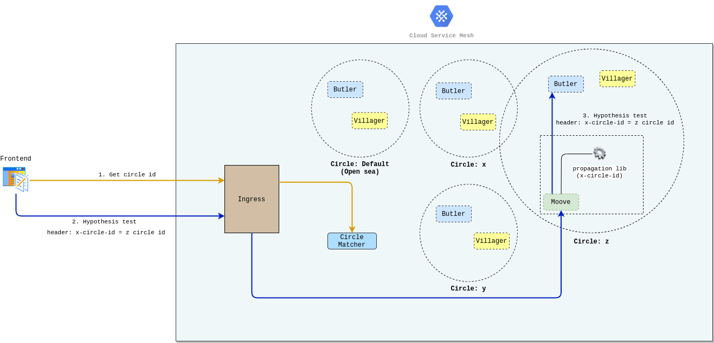

# Configuring your module to propagate the circle's Id

## Why configure it? 

When you work with multiple microservices scenarios, you need to configure the modules to propagate the`X-Circle-Id` header that makes sure the ****[**requests are being redirected to the right version of your application**](../../reference/circles.md#how-do-you-define-it). Then your user base will get to the same version of all microservice that are part of your hypothesis test.

For example, if you test a feature between microservices that have integration with an opening flow account, it is necessary to make sure your user will get to the correct versions that are on your hypothesis test, created for this specific flow. 

You can do this using a library to propagate the `X-Circle-Id` header, which makes the ****[**circle id identified by the circle-matcher** ](../defining-a-workspace/circle-matcher.md)pass all the requests inside the microservice mesh, and the users will be redirected to the right hypothesis test version. 


If there is a microservice inside this flow that isn't part of your test, the circle value will be passed, but your request will fall into the open sea because there isn't any version for that circle. 


### **Example**

See below: 

> 1. When you make a microservice request, `circle matcher` gets the circle id for this specific request. 
> 2. The id is inserted in the header with the `X-Circle-Id` key.
> 3. The propagate header library makes it possible to pass the `x-circle-id` in the header to request to another microservice, in this case `butler`.

When a hypothesis test happens on `butler`, for example, it is integrated with `moove` which is a microservice that answers the requests on the front end.

If you want your request to get to the `butler` correct version, it is necessary that `moove` pass the `x-Circle-Id` header \(obtained by circle matcher\) in the requests made for it. If involves more than one **microservice**, you have to propagate the header to make sure the user gets the same version of that circle. 

When a test happens with `moove` module, for example, and if it is integrated with `villager` and `butler`, the `x-circle-id`  header propagation makes you look for `villager` and  `butler` versions that are the same `moove` ones, however, this is not the scenario, these requests between `moove` and its integration will be treated by the open sea. 

## How to add it?  

Charles has a library that works for any **Java** application that uses **Spring** as a framework and another one for **.NET Core**. These libs were built because there wasn't another way used in these development environments.

To use them, you need to add them to your application: 

* \*\*\*\*[**Lib para Java e Spring** ](https://github.com/ZupIT/charlescd/tree/master/tracing/spring)\*\*\*\*
* \*\*\*\*[**Lib para .NET**](https://github.com/ZupIT/charlescd/tree/master/tracing/dotnet-core%20)\*\*\*\*


For **Node.js** there is already a lib and[ **you can check it on npm page**](https://www.npmjs.com/package/hpropagate)**.**


