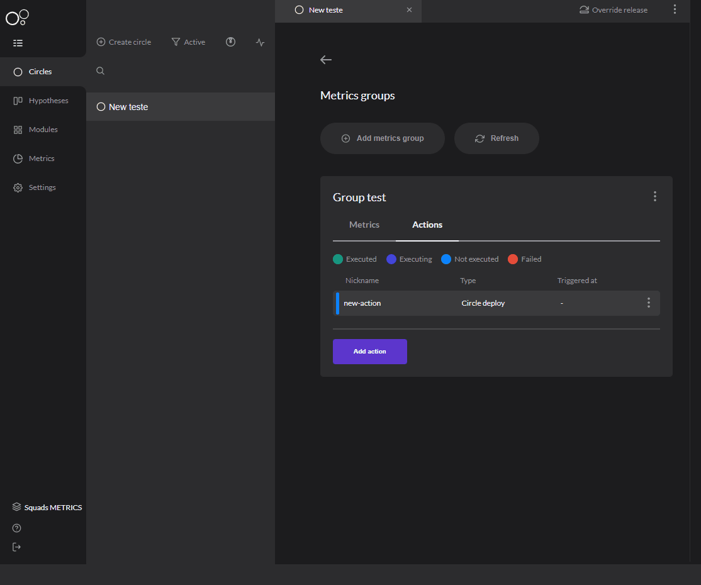

# Metrics actions

## What is it? 

After you had [**registered your metrics group**](../../reference/metrics/metrics-group.md), Charles follows up and offers actions for each one of them. 

## How to configure? 

In workspace configuration, click on the section **Add Metric Action** and follow the steps: 

**1. Add action configuration**: add a configuration action;   
**2. Type a nickname:** writer a name for your action;  
**3. Type a description:** describe the action;  
**4. Select a plugin:** select a plugin to run the action. 


The only available plugin so far is **circle deployment**. Charles allows you to make your own plugin, the way you want and to fulfill your application's purpose, for example, an action that sends an email to warn your circle status.


### Adding an action

After you have configured your action, you have to register in your metrics group and add it to your circle. To do that: 

1. Access Metrics group;  
2. Select '**Add action**' and fill the fields: 
   1. **Type a nickname for action:**  Select the name of your action; 
   2. **Select action type:** Select the action you have configured before; 
   3. **Action configuration:** Configuration to run the chosen plugin. 

### How does it work? 

Inside your circle, you register the [**metrics group**](../../reference/metrics/metrics-group.md), which is responsible to create metrics that you want to track and you can also add action to this group. When you get to the threshold, the action will be triggered and what is described in your plugin will happen, like for example, make a deployment of one circle in another circle. 

You can track the action's status in the 'Metrics group' board, see below: 

