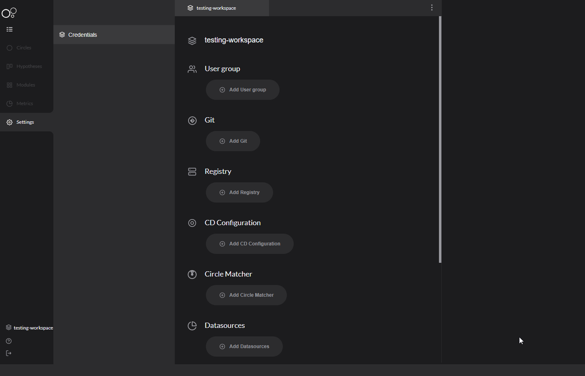

# Datasource

In order to quantify your application's performances and follow up on its status, Charles offers two types of Datasource: Prometheus and Google Analytics. 


Before you add the Datasource, it is necessary to finish your [**metrics configuration**](../../reference/metrics/setting-up-your-metrics.md).


### How to configure? 

You have to follow the next steps: 

1. Click on your name, on the bottom left corner and then select **Settings**;
2. Click on **Credentials;**
3. Click on **Add Datasource;**
4. Select your **tool option;** 
5. **Data source health:** this option gives you more details about your circle's health; 
6. Make the configuration based on the selected tool. 

