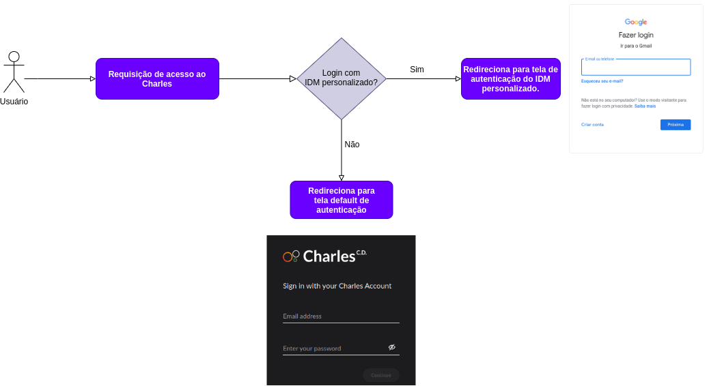

# Defining the Identity Manager

### O que é Identity Manager \(IDM\)?

É o responsável por gerenciar a identidade dos usuários que acessarão uma determinada aplicação, neste caso, o Charles.


Quando o usuário acessa o Charles, é verificado qual gerenciador responsável foi configurado durante a instalação para fazer a validação da identidade do usuário. 


No exemplo da imagem abaixo, é ilustrado um fluxo onde se faz a verificação de qual foi a configuração feita para gerenciar os usuários. Nesse caso, quando o usuário tenta acessar o Charles e ainda não está autenticado, se tiver sido configurado um IDM personalizado, como o Google, por exemplo, o usuário é redirecionado para a própria página do Google para fazer a autenticação. Caso contrário, a tela de autenticação do Charles é retornada para dar sequência ao fluxo.

### Porque configurar um IDM?

Para garantir a segurança dos acessos ao Charles, é necessário ter um gerenciador de identidade. Para isso, o Charles oferece duas opções:

#### IDM Padrão

Na instalação padrão do Charles, já existe o **Keycloak** que é utilizado para fazer a gestão dos usuários. Portanto, se você não tem um IDM personalizado que queira utilizar, a instalação padrão te oferece esse suporte.

#### IDM Personalizado

Caso você tenha seu próprio gerenciador de identidade, é necessário alterar algumas variáveis na instalação. Para isso, siga nossas instruções na [**referência sobre IDM**]().

