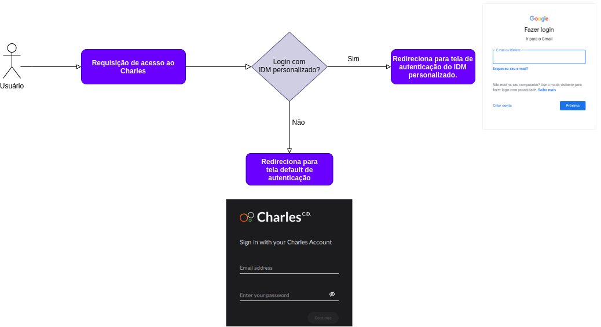

# Defining the Identity Manager

### What is Identity Manager \(IDM\)?

It is responsible to manage the user identity that will access any application, in this case, Charles.


When a user access Charles, it is verified which manager was configured during the installation, to make an identity validation of the user. 


On the example below, you can see a flow where there is a verification of what configuration was made to manage the users. In this case, when a user tries to access Charles and it is not yet authenticated, if an customized IDM has been configurated, for example, Google, the user will be redirected to Google's page to proceed the authentication. If this is not the scenario, Charles authentication screen is returned to continue the flow.

### Why configure an IDM? 

It is necessary to have an identity manager to make sure Charle's accesses are safe. For this, Charles offers two options:

#### Default IDM

On Charles default installation, it already has Keycloak that it is used to manage the users. If you don't have a customized IDM, you can use this one.

#### External IDM 

In case you already have your own identity manager, it is necessary change some installation variables. For that, follow the instruction on [**reference section.**](../../reference/identity-manager.md)\*\*\*\*


There are some blocked flows when using an external IDM, see below:

* Create users;
* Change password;
* Reset password; 
* Delete users. 


