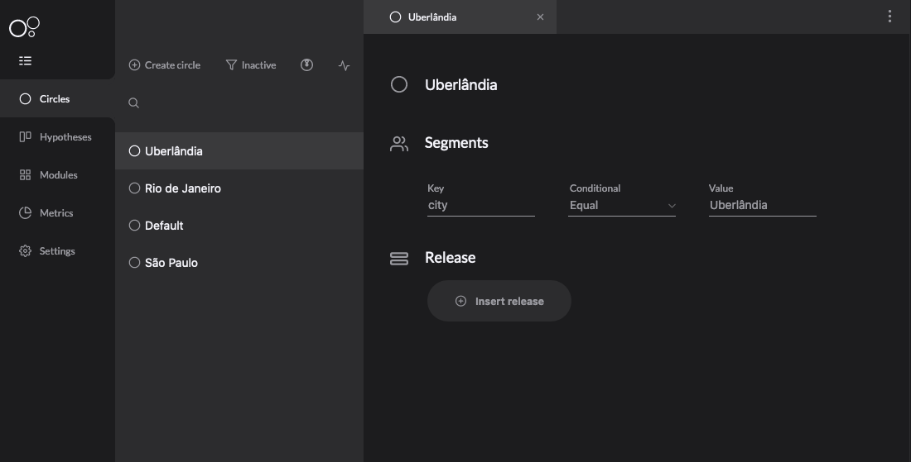
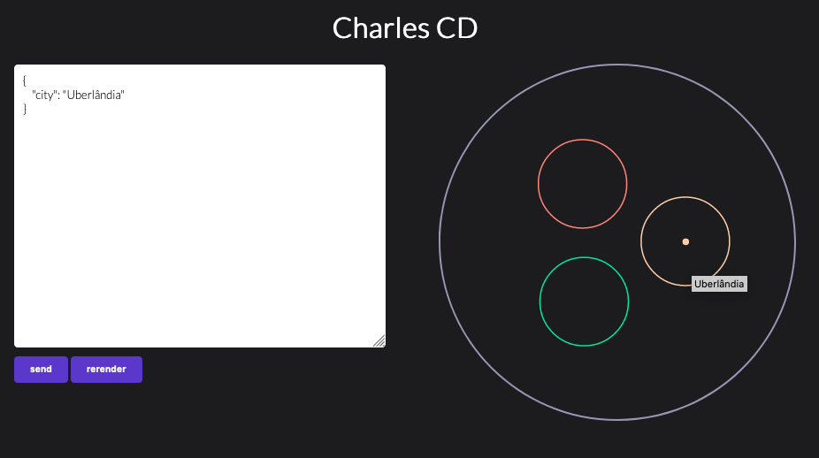

# Caso de Uso

## Circles Sample

Circles Sample é uma aplicação desenvolvida pelo nosso time para que você possa implantá-la em um ambiente de testes e conhecer melhor sobre o conceito de **deploy em círculos**. Além disso, ela pode ser utilizada para entender como configurar o chart template da sua aplicação.


 Para reproduzir este caso de uso é necessário que você já tenha um workspace definido, para saber mais [**veja essa seção**](../primeiros-passos/definindo-workspace/)**.**


O caso de uso se baseia nos seguintes passos:

1. Cadastro do Circles Sample no Charles;
2. Implantação de uma versão em um círculo;
3. Configuração para acesso ao Circles Sample através do seu cluster de Kubernetes;
4. Teste da aplicação utilizando círculos diferentes.

### Cadastrando o Circles Sample nos seus módulos

O projeto está disponibilizado no [**repositório**](http://github.com/zupit/charlescd) ****oficial, para fazer o cadastro do módulo, siga as configurações abaixo:


É necessário um passo anterior onde seja feito upload da imagem da aplicação no seu [**registry**](../primeiros-passos/definindo-workspace/docker-registry.md) ****cadastrado.



Para acessar o chart template do Circles Sample,[ **clique aqui**](https://api.github.com/repos/zupit/charlescd/contents/samples/circles). Caso tenha dúvida sobre essa configuração, veja a [**referência com um passo-a-passo**](../primeiros-passos/criando-seu-primeiro-modulo/configurando-o-chart-template.md).

### Implantando uma versão no círculo Default

Para implantar o exemplo no círculo default, siga os passos: 

1. Vá até o menu **Circles** e marque o filtro **Inactive**;
2. Selecione o círculo **Default**;
3. Clique em **Insert release** e ****escolha a opção **Create Release**.



No campo **Version name** você deve informar o nome completo da release que você deseja utilizar.


### Expondo a aplicação

#### Minikube

Para acessar a aplicação utilizando o Minikube, execute o `minikube tunnel`  e verifique se o **external-ip** gerado para o Circles Sample é diferente de **127.0.0.1 \(localhost\)**. Neste caso altere seu host conforme o exemplo abaixo:


```bash
#127.0.0.1    localhost
<external-ip> localhost
```


#### Cluster

Caso a instalação tenha sido feita em outro ambiente garanta que o Circles Sample esteja no mesmo domínio do `moove`.

### Acessando Circles Sample

Acesse [http://localhost:8080](http://localhost:8080)


Ao acessar a tela do circles sample, você precisa preencher um formulário para que o sample consiga acessar a API do `moove` e listar os círculos do workspace que você definiu. Veja abaixo como: 

* **Insert URL Moove:** insira a API de acesso ao [**moove**](../#arquitetura-do-sistema).
* **Authorization:** informe o token de acesso a api do [**moove**](../#arquitetura-do-sistema). `Bearer access-token`
* **Workspace ID:** informe o id do workspace que você deseja acessar.


Essas informações podem ser obtidas no header de alguma requisição como, por exemplo, listagem de círculos, hipóteses, etc. Ou na aba de cookies do browser.


Agora, você pode criar círculos e identificar em qual círculo o usuário vai entrar  dado um determinado payload, como nas imagens abaixo: 





