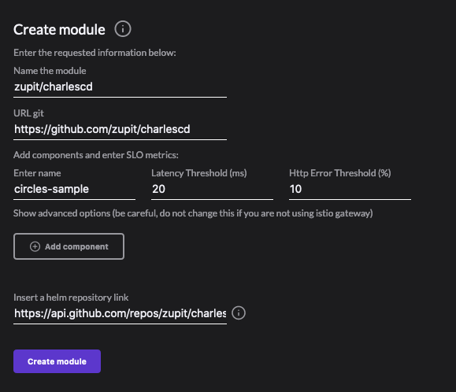
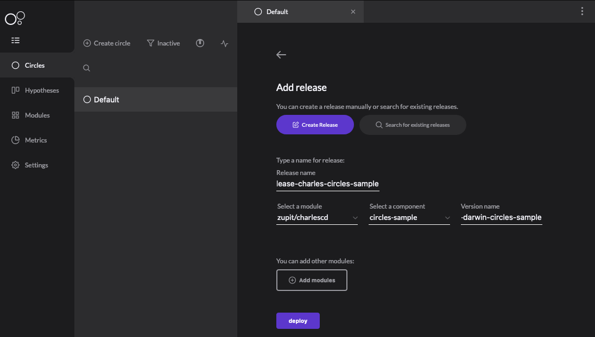
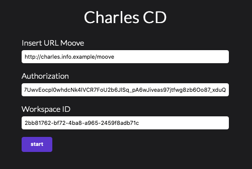
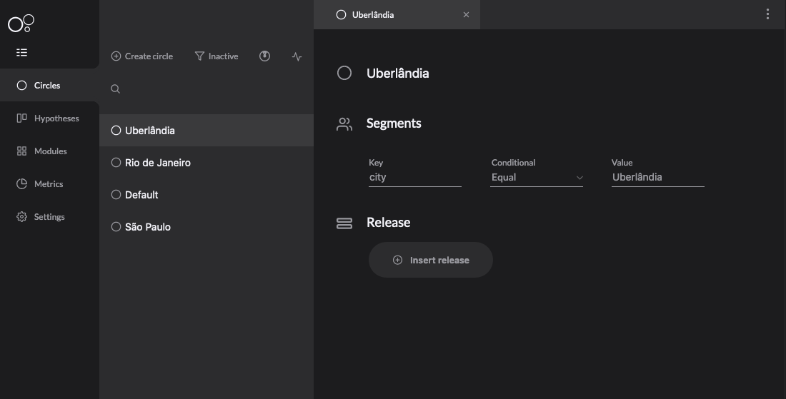
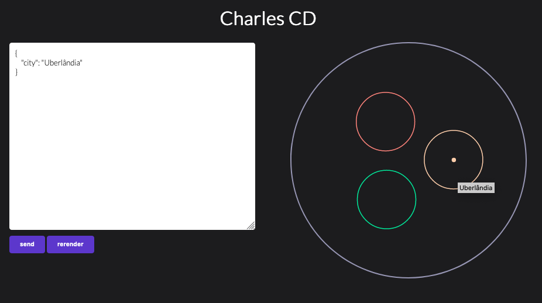

# Use Cases

## Circles Sample

Circles Sample is developed by our team in order to make you able to implement it in a test environment and to get to know the deploy in circles concept better. Besides, it can be helpful to understand how to configure the chart template of your application,


 To run this use case, you must already have a defined workspace, to know more about, [**check this section**](../get-started/defining-a-workspace/).


The use case is based on the following steps:

* Charles Circles Sample register;
* A new version implementation in a circle;
* Configuration to access the Circles Sample through your Kubernetes cluster;
* Application test using different circles.

### Registering Circle Sample in your modules

The project is available in the official [**repository**](http://github.com/zupit/charlescd), to register your module, follow the configuration below: 


Before the steps, it is necessary to make an application image upload in your registred [**registry**](../get-started/defining-a-workspace/docker-registry.md). 




To access the Circles Sample chart template,[ **click here**](https://api.github.com/repos/zupit/charlescd/contents/samples/circles). If you have any doubts about this configuration, check here **a step by step reference**. 

### Implementing a default circle version 

To implement the default circle example, follow the steps: 

1. Go to the Circles menu and select the **Inactive** filter. 
2. Select the **Default** circle; 
3. Click on **Insert** release and choose the **Create Release** option.




On the **Version name** field, you have to inform the full name of the release you want to use. 


### Exposing the application 

#### Minikube

To access the application using Minikube, run the `minikube tunnel` and verify if the **external-ip** generated to the Charles Sample is different from the **127.0.0.1 \(localhost\)**. On this case, change your host like the example below: 


```bash
#127.0.0.1    localhost
<external-ip> localhost
```


#### Cluster

In case the installation had been made in another environment, make sure that the Circle Sample it is on the same `moove` domain.

### Accessing Circles Sample

Access [http://localhost:8080](http://localhost:8080)



When accessing the circles sample screen, you need to fill out a form, so the sample is able to access the `moove` API to list the worspace circles you have defined. See below how to it: 

1. **Insert URL Moove:** insert an API to access a [**moove**](../#arquitetura-do-sistema).
2. **Authorization:** inform the access token to the  o [**moove**](../#arquitetura-do-sistema) API**.** `Bearer access-token`
3. **Workspace ID:** inform the workspace id you want to access. 


You can get this information on some request header, for example, circles list, hypothesis, etc. Or in the cookies tab in the browser.


Now, you are able to create circles and identify in which circles the user will enter given a certain payload, see it on the images below: 





