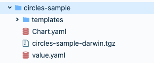

# Configurando o chart template

## **O que é o Helm?**

O Helm Charts é um gerenciador de pacotes que auxilia na definição instalação e atualização das mais complexas aplicações no Kubernetes. O Charles utiliza o ****[**Chart Template**](https://helm.sh/docs/chart_template_guide/getting_started/), que é uma coleção de arquivos relacionados a configurações do Kubernetes. 

## Como configurar o chart template? 

### **Diretório do chart template**

Primeiro, você pode salvar os seus templates em qualquer ferramenta de versionamento que preferir.  Ao criar um novo chart template você precisa dar ao diretório, o mesmo nome do componente ao qual ele se refere**.**  A estrutura abaixo contém os templates necessários para se fazer o deploy de um módulo que possui um componente chamado “circles-sample” e ele está **disponível aqui**. 

Veja a imagem abaixo:  

### Itens do diretório 

Para configurar seu diretório, são necessários alguns itens, veja abaixo quais arquivos:

* **templates/ :** contém nossos modelos. 

  * **deployment.yaml:** descreve a estrutura de [**deployment**](https://kubernetes.io/docs/concepts/workloads/controllers/deployment/).
  * **service.yaml:** descreve a estrutura do [**service**](https://kubernetes.io/docs/concepts/services-networking/service/). 

* O arquivo **Chart.yaml** contém uma descrições como version, name, description. É necessário definir a version como "darwin".
* O arquivo **value.yaml** possui os valores que serão utilizados nos nossos templates. 

Essas são as informações que o Charles precisa ter no templates. Vale ressaltar que você pode incrementar esses templates da forma como você preferir.


Com o seu diretório configurado de acordo com a estrutura acima vá até a pasta "circles-sample" e execute o comando  **"`helm package .`"**.  Ao final desse comando você terá uma arquivo **tgz** com o nome de circles-samples-darwin.


