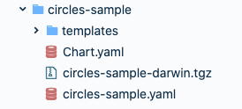

# Configurando o chart template

## **O que é o Helm?**

O Helm Charts é um gerenciador de pacotes que permite você definir, instalar e atualizar as aplicações no Kubernetes, independente do grau de complexidade.  

### Chart template no contexto do CharlesCD

O [**Chart Template**](https://helm.sh/docs/chart_template_guide/getting_started/) ****é usado como uma coleção de arquivos relacionados a configurações do Kubernetes. 

Os charts devem seguir o [**padrão do Helm**](https://helm.sh/docs/topics/charts/), e precisam ****estar contidos dentro de uma pasta com o nome da componente cadastrada no Charles. Você não precisa executar nenhum comando para empacotar o chart, o Charles faz o download dos arquivos e finaliza tudo automaticamente.  
  
Veja abaixo o exemplo de um repositório contendo o chart da componente **http-https-echo** no GitHub:


O módulo de deploy Butler utiliza charts helm para disponibilizar as suas aplicações no Cluster. Esses charts devem estar disponíveis em um repositório Github ou Gitlab e acessíveis por meio do token cadastrado na configuração de deployment. A URL deles é providenciada junto ao cadastro do módulo.


Se você não tiver configurado o **seu módulo,** [**acesse o tutorial de como criar**](./) **um.** E você também deve cadastrar a URL no módulo.


### **Templates**

O único requisito para que os templates funcionem com o Charles é que as **labels component** e **tag** estejam presentes nos manifestos do recurso Deployment. 


Não é necessário inserir os valores no arquivo de _**values**_  ****do seu chart, o Charles irá provê-los automaticamente.


Veja o exemplo abaixo:

```text
component: {{ .Values.component }}
tag: {{ .Values.tag }}
```

Internamente o Butler armazena os charts compilados em entidades que representam cada solicitação de deploy. Desta forma**,** o Charles realiza rollbacks mais eficientes.

## Como configurar o chart template? 

Siga os próximos passos para configurar o app de exemplo.

### **Passo 1: Crie um diretório do chart template**

Para começar, você precisa salvar os seus templates em uma ferramenta de versionamento da sua preferência. Assim que criar um novo chart template, você precisa dar ao diretório o mesmo nome do componente ao qual ele se refere**.** 

 A estrutura abaixo contém os templates necessários para se fazer o deploy de um módulo que possui um componente chamado “circles-sample”. 

A imagem demonstra como seu diretório deve ficar:  



### Passo 2: Configure os itens do diretório 

Depois de criado o diretório, você deve configurá-lo. Veja quais arquivos são necessários para seguir com essa configuração: 

* **templates/ :** contém nossos modelos. 

  * **deployment.yaml:** descreve a estrutura de [**deployment**](https://kubernetes.io/docs/concepts/workloads/controllers/deployment/).
  * **service.yaml:** descreve a estrutura do [**service**](https://kubernetes.io/docs/concepts/services-networking/service/). 

* O arquivo **Chart.yaml** contém uma descrições como version, name, description. É necessário definir a version como "darwin". 
* O arquivo **circles-sample.yaml** possui os valores que serão utilizados nos nossos templates. 

Essas são as informações que o Charles precisa ter no templates. Vale ressaltar que você pode incrementar esses templates da forma como você preferir.


Com o seu diretório configurado de acordo com a estrutura acima, vá até a pasta "circles-sample" e execute o comando  **"`helm package .`"**.  

Ao final desse comando, você terá uma arquivo **tgz** com o nome de circles-samples-darwin. Nossa ferramenta de CD procura esse **tgz** para executar o template


