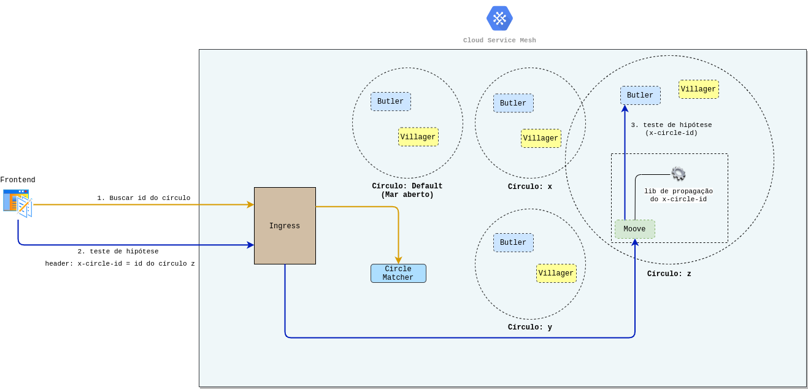

# Configurando seus módulos para propagar o id do círculo

## Por que configurar? 

Quando você trabalha em cenários com vários microsserviços, configurar os módulos é uma forma de garantir a propagação de header `x-circle-id` e com isso certificar o [**roteamento dos usuários para as versões corretas**](../../referencia/circulo.md#como-integrar-circulos-com-servicos). Dessa forma, você torna possível que o usuário da sua base chegue na mesma versão de todos os microserviços que fazem parte do seu teste de hipótese.

Por exemplo, se você testar uma feature entre microserviços que tenham integrações em um fluxo de abertura de conta, é necessário garantir que o usuário será redirecionado a todas as versões corretas que estão no teste de hipóteses, criado para esse fluxo.

Para garantir isso, você pode utilizar uma biblioteca de propagação do header `x-circle-id`, que faz com que o [**id do círculo identificado pelo `circle-matcher`**](../../referencia/circle-matcher.md#identificacao-de-circulos-atraves-da-api)seja repassado entre todas as requisições dentro da malha de microserviço, garantindo assim, que os usuários sejam redirecionados para a versão correta do seu teste de hipótese.


Caso exista um microserviço dentro do fluxo que não faz parte do seu teste, o valor do círculo será repassado, mas a sua requisição cairá em mar aberto, porque não há nenhuma versão destinada para aquele círculo. 


### **Exemplo**

Veja o workflow abaixo que mostra como a configuração funciona: 

> 1. Ao realizar a chamada de um microserviço, o id do círculo que o usuário pertence é obtido por meio do módulo `circle-matcher`.
> 2. O id é inserido no header de todas as próximas requisições com a chave **`X-Circle-Id`**.
> 3. A biblioteca de propagação possibilita repassar o **`x-circle-id`** no header para a chamada de um outro microserviço, no caso o **`butler`.**

No Charles quando acontece um teste de hipótese no `butler`, por exemplo, ele está integrado com o `moove`que é o microserviço que atende as requisições do frontend. 

Se você quiser que sua requisição chegue na versão correta do `butler`, é preciso que o **`moove`** repasse o header **`X-Circle-Id`** \(obtido por meio de uma requisição para o `circle-matcher`\) nessas requisições feitas para ele. E se envolver mais de um **microserviço,** é preciso propagar o header para garantir que o usuário tenha a mesma versão daquele círculo.

Quando acontece um teste no `moove` e se ele estiver integrado com o `villager` e o `butler`, a propagação do header `X-Circle-Id` faz com que você procure por versões do `villager` e do `butler` na mesma versão do `moove`, porém como esse não é o cenário, essas requisições entre o `moove` e suas integrações serão tratadas pelo mar aberto.

## Como adicionar? 

O Charles possui uma biblioteca \(lib\) que funciona para qualquer aplicação **Java** que utilize o **Spring** como framework ****e outra para **.NET Core.** As libs foram construídas por não existir nenhuma alternativa amplamente utilizada para esse cenário. 

Para usá-las, você precisa adicioná-las a sua aplicação:

* \*\*\*\*[**Lib para Java e Spring** ](https://github.com/ZupIT/charlescd/tree/master/tracing/spring)\*\*\*\*
* \*\*\*\*[**Lib para .NET**](https://github.com/ZupIT/charlescd/tree/master/tracing/dotnet-core%20)\*\*\*\*


Para o **Node.js** já existe uma lib, [**veja na página do npm**](https://www.npmjs.com/package/hpropagate). 


