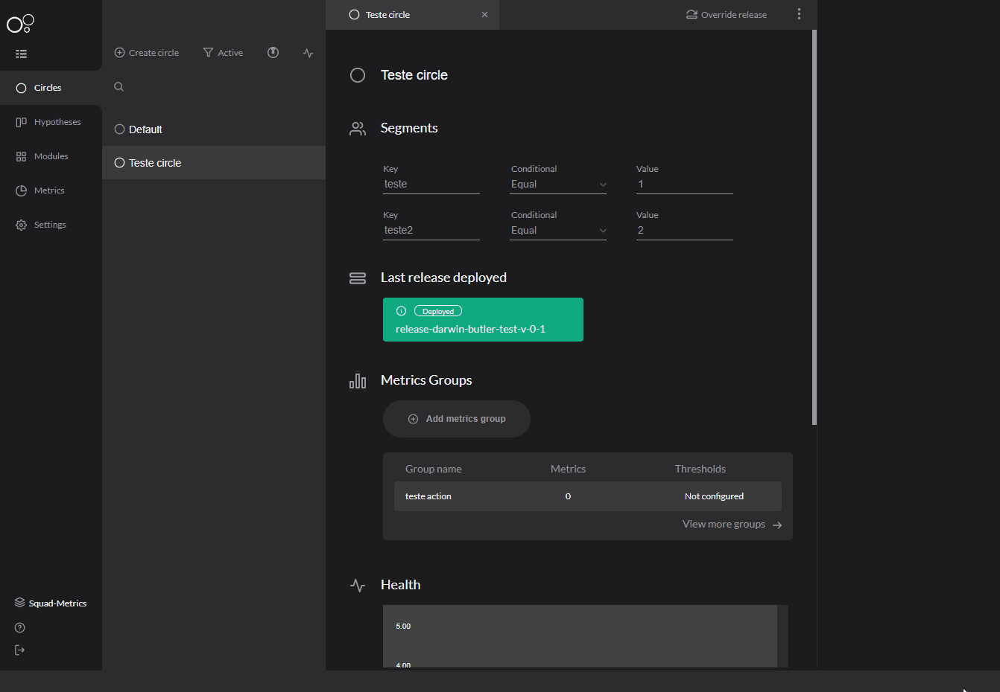

# Ações de métricas

## O que é? 

Depois de [**cadastrar seu grupo de métricas**](../../referencia/metricas/grupo-de-metricas.md), o Charles mostra o acompanhamento delas e oferece ações para cada uma delas. 

## Como configurar? 

Em configurações do workspace, clique na seção **Add Metric Action** e siga os passos:

**1. Add action configuration**: Adicione uma ação de configuração;  
**2. Type a nickname:** Escreva um nome para sua action;  
**3. Type a description:** Descreva o sua action;  
**4. Select a plugin:** Selecione um plugin para executar a ação.


O único plugin disponível no momento é o **circle deployment**. Ele permite que o Charles faça o seu próprio plugin para atender às necessidades da sua aplicação como, por exemplo, uma action que envie e-mail para avisar o status do círculo.


### Adicionando a action 

Depois de configurar sua action, você deve cadastrá-la no seu grupo de métricas e adicioná-la ao seu círculo. Para fazer isso:

1. Acesse o grupo de métricas; 
2. Selecione '**Add action**' e preencha os campos: 

   1. **Type a nickname for action:** Selecione o nome da sua action;
   2. **Select action type:** Selecione a action que você configurou antes;
   3. **Action configuration:** Configuração de execução do plugin escolhido.

### Como funciona? 

Dentro do seu círculo você cadastra o [**grupo de métricas**](../../referencia/metricas/grupo-de-metricas.md), ****que é responsável por criar métricas que você quer acompanhar e você também vincula ações a esse grupo. Quando todos thresholds são alcançados, a ação será disparada e ocorrerá o que está descrito no plugin como, por exemplo, fazer o deploy daquele círculo em um outro círculo.

Você pode acompanhar o status da action no quadro dentro de 'Grupo de métricas', veja abaixo: 

