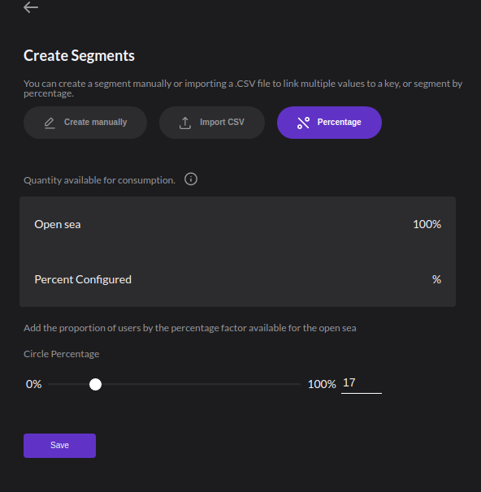
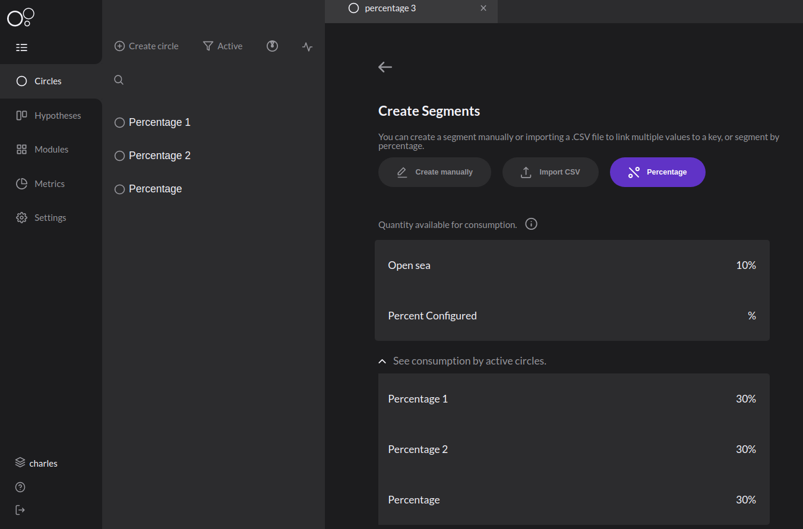

# Circles

Circles are the main approach related to the [**new deploy concept**](../faq/about-charles.md#what-is-circle-deploy) brought by Charles. It enables user group creation with several characteristics and promotes simultaneous application tests for a great number of possible users.


Circles indicate client segmentation and also support the version management created for a specific audience.

Once the right people are chosen to have access to your release associated with a circle, Charles will generate a[ **series of business or performance metrics**](metrics/#charles-available-metrics). This information will give you better hypothesis results or even a better view on a feature in analysis and that will enable more assertive tests.

## How to create circles?

To create a circle, you just have to follow these steps:

**1.** Click on Create Circle.  
**2.** Give a name to your circle.  
**3.** Define a segmentation.  
**4.** \[Optional\] Implement a release.

## What is segmentation? 

Segmentations are a **subset of characteristics or percentage values** that you define to put all your users together in a circle. There are three ways to segment your users: 

* **By filling in information manually** 
* Through a **CVS file importation**.
* Through a **percentage value related to the total amount of access to your application**. 

### Segmentations fields 

Segmentations have the following fields that you have to fill: 

* **Key:** it is the same value in the user's identify request payload.
* **Conditional:** it is the logical implication that will condition your key and value.
* **Value:** they are the values in your base that can be used to make the segmentation logic.

#### Key and value

The **key** and **value** fields are established based on the information that will be sent in the request, that [**identifies the circles**](../get-started/defining-a-workspace/circle-matcher.md) where your user belongs to. For example, the payload below could represent the information you have about a client:

```text
{
  "id": "7f2926d5-ff08-4d49-96df-d4ba0fc07b52",
  "name": "Alice",
  "state": "MG",
  "city": "Uberlândia",
  "age": "47",
  "groupId": "a435bd12-ae82-48c8-b164-066d91ffe3a5"
}
```

The keys used could be any of the ones sent in your application payload to the Charles' circle-matcher, such as **id**, **name**, **state**, **city**, **age** e **groupId**. 


**Your payload and your keys must be the same.** 


### Percentage

The segmentation by percentage has the following field: 

* **Percentage**: value that indicates the percentage \(%\) of the requests that will be directed to a circle. For example, in a scenario where there is a circle with a percentage of 10% for every 100 requests, approximately 10 will go to the circle.


The sum of the active circles' factors with segmentation by percentage should never exceed 100.

If it is equal to 100, it means that the **Default** circle will never be indicated by the Circle Matcher.


This happens only to users that belong to a **Default** circle, meaning the users belonging to circles with manual or CSV segmentation will never be directed to circles with segmentation by percentage. 

If in your configuration there are circles with segmentation by rules and circles with segmentation by percentage, see the Circle Matcher identification logic below: 

1. It verifies if the payload matches some segmentation circle by rules. If it does, these circles will be returned and the circle's search is ended. 
2. If there isn't any compatible circle and there are active circles with segmentation by percentage, a random number between 1 and 100 is drawn and if it is less than or equal to the circle's factor, this one is returned. 
3. In case any of the previous steps finds a compatible circle, the **Default's** circle id is returned. 

### Circle creation example 

See the example on how to create a circle below: 



**The best advantage to use segmentation** is the possibility to combine logic with several attributes to create different audience categories and, in this way, use them on hypothesis tests. 

For example, using the characteristics ‘profession’ and ‘region’, you are able to create a circle with engineers from the Brazilian north region, another one with engineers from the southeast, and the third one with all Brazilian engineers.


### **Manual segmentation**

On this kind of segmentation, you define the logic the circle will follow to build a match with predetermined characteristics.

These characteristics can be defined based on the following logic:

* Equal to
* Not Equal
* Lower Than
* Lower or equal to
* Higher than
* Higher or equal to
* Between
* Starts With

See some examples below:


### **Segmentation by CSV importation**

This segmentation is used only in the first CSV column to create rules. The first line in the first column must contain the key name and the same one must be informed on the key field.


After you have finished the file upload and saved the configuration, an overview will show up demonstrating how your segmentation is:


This way allows you to extract from an external client’s IDs base, a specific profile and import them directly on Charles. When a .csv file is imported and if it contains some empty lines, it will occur an importation error, because empty segments are not allowed.


OR is the only logic operator supported on this segmentation.


### **Segmentation by percentage**

It is a kind of segmentation that distributes to the circles the number of requests not filtered in a manual segmentation. These requests are delivered, proportionally between configured circles and the default circle. The value of the percentage for each circle is defined between 0 and 100, and the sum of all active circles cannot exceed 100%.

#### Segmentation by percentage example

Suppose you have created two circles with percentage: 

* Circle **A,** with 15%.
* Circle **B,** with 26%.

Now, the algorithm for identification draws a number between 1 and 100, and after that, it analyzes: 

1. If the number is less than or equal to 15, circle **A** is returned.
2. If the number is bigger than 15 and less than or equal to 41 \(15 + 26\), **circle B** is returned. 
3. If the number is bigger than 41, the **Default** circle is returned.

If there isn't a configured circle or an active one, the available amount will be 100%, like the image below: 



If you have, for example, three active circles by percentage and each one of them have a 30% value, the available amount for your new circle will be 10%, see below:  



After the segmentation is created, the available percentage will be only altered if a new release is deployed for that circle, and then it will become active.


If, for example, the **percentage hits the available 100%**, it is necessary to change or remove the configured active circles in order to make more space, after that you are able to create a new circle. 


### How to get **my circle's identifier**? 

Once your circle is created, even without the configuration, it already has a single identifier. 

To get this information, select the workspace you want, and then on the left menu, click on **Copy ID.**


## Active and inactive circles

The existence of releases defines if a circle is active or not, which are the implemented versions for user segmentation. Therefore, active circles have implemented releases while the inactive circle doesn't have any.


## How to integrate circle with services?

Once the **circle to which the user belongs** is detected, this information must be passed on to all next requests through the `x-circle-id`parameter on the header. Charles detects by the circle’s ID which application version a determined request must be forward. Check out how it works below:


At some point during the interaction of the user and your application **\(App1\)**, for example, the login - the **`Identify`** service of **`charles-circle-matcher`** - must be triggered to get the circle.

By that, the ID must be passed on as a value in the **`x-circle-id`** parameter located on the header of all next requests of your services **\(`App2`\).** Charles is responsible to disseminate this information because when it's received on Kubernetes, it will be used to redirect the request to a corresponding release version associated with a circle.

If the **`x-circle-id`** is not passed on, all the requests will be redirected to **Default** versions, which means it will use the standard releases of your applications, without a specific segmentation.

### **A mix of services with different versions of my release**

We will give an example of a specific scenario where your environment has two services: **Application A** and **Application B** and your circles must use the following versions:


So, the redirect logic using **`x-circle-id`** will be:

1. The user sends to the header:  `x-circle-id="QA Circle"`. On this circle, the request will be redirected to a **X version** of the service on **Application A** and the **Y version** of the service on **Application B**. 
2. The user sends to the header:  `x-circle-id=”Dev Circle”`. On this circle, the request will be redirected to the **Z version** of the service on **Application A** and **Z version** of the service on **Application B.** 


## How to route your circles with Kubernetes Clusters?

**Charles** involves [**Kubernetes**](https://kubernetes.io/docs/home/) and ****[**Istio**](https://istio.io/docs/) ****on traffic routing. Let's think about a scenario where there are two circles:

* Campinas residents \(identify by ID 1234\);
* Belo Horizonte's residents \(identify by ID 8746\).

Both circles were implemented with service releases called **'application'**, but with different versions:

* Campinas' residents \(1234\): version 2, v2.
* Belo Horizonte's residents \(8746\): version 3, v3.

Besides that, there is a default \(v1\) version for users that don't fit in any specific circle.

Let's supposed that, to make a request to identify a user, an ID 8756 is returned. This information will be passed by the next service interaction through the header `x-circle-id`. The image below shows how Charles uses the internal resources to route the correct release.


When performing a version implementation in a circle, Charles makes all the configurations so that the routing is correctly done. To understand better how this works, let's use a scenario where a request comes from a service outside the stack, see the image above.

The request will be received by Ingress, which performs all the routing control to the service mesh.

1. Once the request entry is allowed, Virtual Service inquiries the traffic routing rules to be applied on the addressed host. In this case, the evaluation happens through`x-circle-id` header specification, in a way that the traffic corresponds to the **application** service. 
2. Besides the service, it is also necessary to know which subset is defined on the register. This verification is made on **Destination rules**. 
3. The traffic redirect is performed based on previous information until it gets to the service version. 
4. If the `x-circle-id` is not informed, there is a rule defined by Virtual Service that will forward to the default version \(v1\). 

