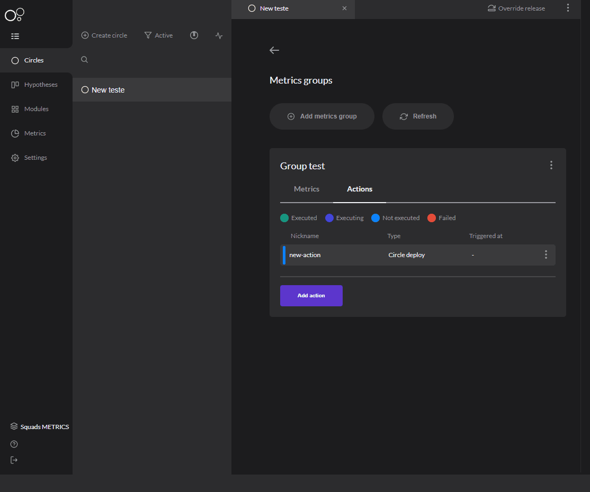

# Action

## Adding an action

After you have[ **configured your action**](../../get-started/defining-a-workspace/metrics-actions.md#how-to-configure), you have to register it in your metrics group and add it to your circle. 

Follow the next steps to do that: 

**Step 1:** Access Metrics group;   
  
**Step 2:** Select '**Add action**' and fill in the fields: 

* **Type a nickname for action;** 
* **Select action type:** Select the action you have configured before; 
* **Action configuration:** Configuration to run the chosen plugin. 

### How does it work? 

Actions are triggers that will be triggered when all the predetermined thresholds are reached in a metric group. 

[**Metric groups** ](metrics-group.md)create metrics you want to track and you can also add actions to this group. When you get to the threshold, the action will be triggered and what is described in your plugin will happen, for example, make deployment of one circle in another circle. 

You can track the action's status in the '**Metrics group**' board, check out below: 

