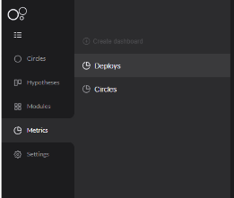
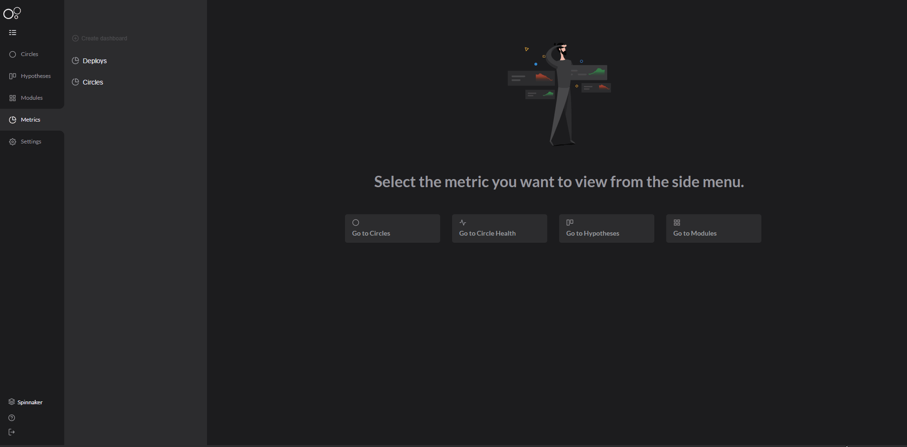

# Charles' metrics

Charles offers metrics for you to monitor deploys and circles. 

## Deploy metrics

Deploy metrics shows a dashboard view with deployment information for you to follow up, such as success or error occurrence numbers and the average implementation time.

There is other available information: 

* Release name;
* The chosen circle;
* Deploy's date and duration;
* Responsible for the deployment;
* Undeploy cases;
* Modules, components, and used versions;
* Deploy status: Deployed, Deploying, Error, Undeployed, and Undeploying.

See the example below:  

## Circles metrics 

It is a management feature that helps you view and follow the technical information about your circles.

The circle metrics allows you to have an overview of your circles on Charles, like:  

* \*\*\*\*[**Active and inactive**](../circles.md#active-and-inactive-circles) circles;
* Circle average lifetime;
* Last update date.

Check out below: 

