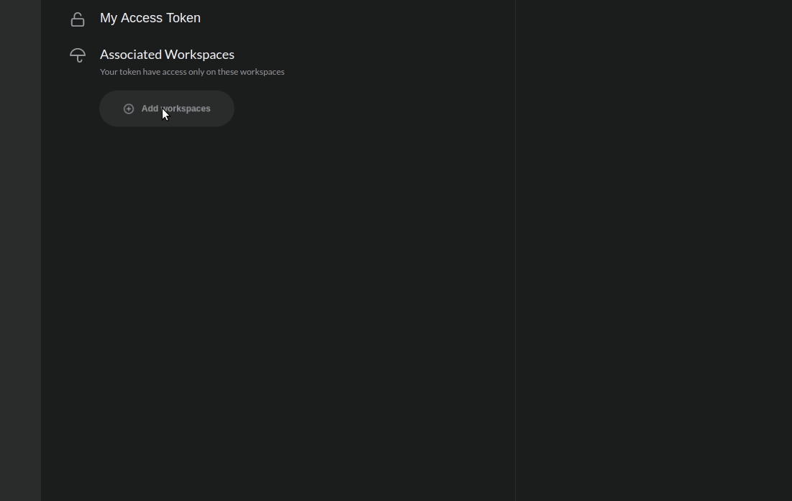

# System Token

## What is it? 

A system token is an opaque string of characters that identifies a user or an application. It can be used by integration to call Charles C.D's internal APIs. 


If you want to integrate Charles into your deployment pipeline, **you will need a permission system token** to execute actions. 


When you access Charles with the root profile, the **"System Token"** item will show up on the menu. This is the token management area where you can create new tokens, view the existing ones, revoke and recreate. 

## How can you create?

To create a system token, you need to fill in three pieces of information: 

1. The **name** to identify the token; 
2. The **workspaces** it will have access to;
3. Which permission **scopes** the token will be able to work in the workspaces.

### Workspaces

You have two options to choose the workspaces: 

* Allow the token to have access to all workspaces:

* Select specific workspaces:

### Scopes

The scopes define which actions a token can perform. You can create your token with one or more scopes. To do that, choose the best options below: 

* **Modules:** full access \(reading and writing\) of the APIs referring to the modules. 
  * **Writing**: access to create, update and delete modules 
  * **Reading:** access to read all modules.
* **Circles**: full access \(reading and writing\) to the APIs referring to the circles. 
  * **Writing**: access to create, update and delete circles. 
  * **Reading**: access to read all circles.
* **Deploy:** full access \(reading and writing\) to circles release implementation. 
* **Maintenance:** full access \(reading and writing\) to the workspaces' configurations. 

## How to copy a token? 

After you have finished customizing your token, **don't forget to copy it**. It is not possible to copy this token again. 

## How can you revoke a token?

You can revoke the token's permissions, to do that, check out below: 

* Access the token menu; 
* Select the token;
* Click on  **`Revoke Token`** option.

## How can you generate a token again? 

If you lost the value of your token, it is possible to create it again with all the existing permissions. When you do that, the previous value is canceled and the new value is the only one valid. Check out the example below: 

1. On the top menu, click on "**Regenerate**";
2. Confirm the action in the "**Yes, regenerate token"** button that will pop up;
3. Done! A new token will be generated. 

