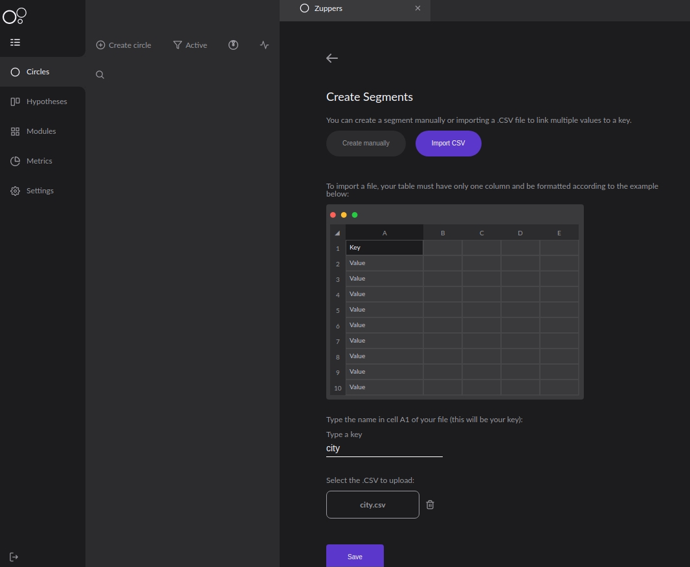
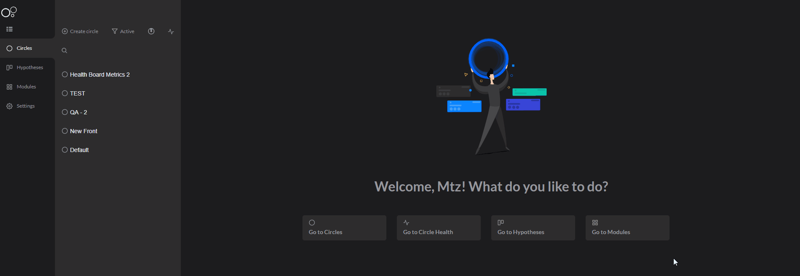

# Círculo

Os círculos são o principal diferencial do [**novo conceito de deploy** ](../faq/sobre-charles.md#o-que-e-deploy-em-circulos)trazido pelo Charles. Ele possibilita a criação de grupos de usuários a partir de diversas características e, dessa forma, promove testes simultâneos de aplicações para o maior número possível de usuários.


Além de indicar as segmentações de clientes, os círculos também auxiliam na gestão de versões implantadas para este público.

Uma vez escolhidas as pessoas certas para terem acesso à sua release associada ao círculo, o Charles irá gerar uma [**série de métricas** ](metricas/)de negócio ou desempenho. Essas informações te darão maior visibilidade dos resultados de uma hipótese ou feature em análise, possibilitando testes mais assertivos.

## Como criar círculos?

Para você criar um círculo, siga os seguintes passos:

**1.** Clique em **Create Circle**.  
**2.** Dê um nome ao seu círculo.  
**3.** Defina uma **segmentação**.  
**4.** \[Opcional\] Implante uma release.

## O que é uma segmentação? 

As segmentações são um **conjunto de características** que você define para agrupar seus usuários nos círculos. Existem duas maneiras de segmentar seus usuários: 

1. Através do **preenchimento de informações de forma manual.**
2. Por meio da **importação de um arquivo CSV**.

### Como definir? 

As segmentações possuem os seguintes campos: 

* **Chave**: é o mesmo valor presente como chave payload da requisição de identificação do usuário.
* **Condição**: é a implicação lógica que condicionará sua chave e seu valor.
* **Valor**: são os valores existentes na sua base que poderão ser utilizados para compor a lógica de segmentação.

Os campos **chave** e **valor** são estabelecidos com base nas informações que serão enviadas na requisição que [**identifica os círculos**](circle-matcher.md#identificando-circulos-atraves-do-charlescd) ****que o seu usuário pertence. Por exemplo, considere que o seguinte payload represente as informações que você possui do seu cliente:

```text
{
  "id": "7f2926d5-ff08-4d49-96df-d4ba0fc07b52",
  "name": "Alice",
  "state": "MG",
  "city": "Uberlândia",
  "age": "47",
  "groupId": "a435bd12-ae82-48c8-b164-066d91ffe3a5"
}
```

As chaves utilizadas podem ser qualquer uma enviada no payload da sua aplicação ao circle-matcher do Charles, como: **id**, **name**, **state**, **city**, **age** e **groupId**. 


É importante lembrar que o seu payload e as chaves devem ser exatamente iguais.


Veja abaixo um exemplo de como criar um círculo: 



Uma **grande vantagem de utilizar as segmentações** é a possibilidade fazer combinações lógicas entre vários atributos para criar diferentes categorias de públicos e, dessa forma, utilizá-los nos testes das hipóteses.   
  
Por exemplo, a partir das características “_age_” e “_state_”, é possível criar círculos por faixas etárias por região.


### **Segmentação manual**

Nesta segmentação, você define as lógicas que o círculo deve seguir para compor uma combinação com usuários que atendam às características pré-determinadas.

Essas características podem ser definidas com base nas lógicas de:

* Equal to
* Not Equal
* Lower Than
* Lower or equal to
* Higher than
* Higher or equal to
* Starts With

Veja alguns exemplos:


### **Segmentação por importação de CSV**

Nessa modalidade, é utilizada apenas a primeira coluna do CSV para criar as regras. Sendo assim, a primeira linha da primeira coluna deve conter o nome da chave e a mesma deve ser informada no campo _key:_



Depois de ter feito o upload do arquivo e salvado as configurações, aparecerá um overview demonstrando como está sua segmentação:


Essa segmentação permite, por exemplo, extrair de uma base externa de IDs dos clientes um perfil específico e importá-los direto na plataforma do Charles. Quando um arquivo .csv é importado e se ele conter alguma linha em branco, ocorrerá um erro da importação, pois não é permitido a criação de segmentos dessa forma.


O único operador lógico suportado nesta segmentação é o OR \(Ou\).


### Como obter o identificador do meu círculo?

Assim que seu círculo é criado, mesmo sem a definição das configurações, ele já possui um identificador único. 

Para obter essa informação, siga estes passos: 

1. Selecione o círculo
2. Clique em "default" 
3. E, no menu à esquerda, clique em **Copy ID**



## Círculos ativos e inativos

O que define se um círculo é ativo ou não, é a existência de [**releases**](release.md), isto é, de versões implantadas para aquela segmentação de usuários. Por isso, os círculos ativos são os que possuem releases implantadas, enquanto os círculos inativos ainda não possuem nenhuma.


## Como integrar círculos com serviços?

Uma vez detectado o [**círculo ao qual o usuário pertence**,](circle-matcher.md#identificacao-de-circulos-atraves-da-api) essa informação deve ser repassada para todas as próximas requisições através do parâmetro **`x-circle-id`** no header. Isso acontece porque o Charles detecta pelo ID do círculo para qual versão da aplicação uma determinada requisição deve ser encaminhada. Vejamos o exemplo abaixo:


Na prática, em algum momento durante a interação do usuário com a sua aplicação \(**`App1`**\) - por exemplo, o login - o serviço **`Identify`** do **`charles-circle-matcher`** deverá ser acionado para obter o círculo.

Com isso, o ID deve ser repassado como valor no parâmetro **`x-circle-id`** localizado no header de todas as próximas chamadas dos seus serviços \(**`App2`**\). O Charles é responsável por propagar essa informação porque quando recebida no Kubernetes, será utilizada para redirecionar a requisição para a versão correspondente à release associada ao círculo.

Caso o **`x-circle-id`** não seja repassado, todas as requisições serão redirecionadas para versões **Default**, ou seja, para releases padrões das suas aplicações sem uma segmentação específica.

### **Mescla de serviços com versões diferentes na minha release**

Para facilitar o entendimento, vamos exemplificar com um cenário onde o seu ambiente possui dois serviços: **Aplicação A** e **Aplicação B** e os seus círculos devem fazer o uso das seguintes versões:


Sendo assim, a lógica de redirecionamento utilizando o **`x-circle-id`**será:

1. O usuário envia no header: `x-circle-id="Círculo QA"`. Nesse círculo, a chamada será redirecionada para a **versão X** do serviço **Aplicação A** e a **versão Y** do serviço **Aplicação B**. 
2. O usuário envia no header: `x-circle-id=”Circulo Dev”`. Nesse círculo, a chamada será redirecionada para a **versão Z** do serviço **Aplicação A e a versão Z** do serviço **Aplicação B.**


## Como rotear círculos com cluster de Kubernetes?

O **Charles** envolve o [**Kubernetes**](https://kubernetes.io/docs/home/) ****e o ****[**Istio**](https://istio.io/docs/) ****no roteamento de tráfego, considere o seguinte cenário onde existe dois círculos:

* Moradores de Campinas \(identificado pelo ID 1234\);
* Moradores de Belo Horizonte \(identificado pelo ID 8746\).

Em ambos os círculos foram implantadas releases do serviço chamado "**application**", mas com versões diferentes:

* Moradores de Campinas \(1234\): utiliza a versão v2.
* Moradores de Belo Horizonte \(8746\): utiliza a versão v3.

Além disso, existe uma versão default \(v1\) para usuários que não se encaixam em algum círculo específico.

Suponha que, ao realizar a requisição para identificação do usuário, seja retornado o id 8756. Com isso, essa informação deverá ser repassada nas próximas interações com serviços através do header `x-circle-id`. A imagem abaixo retrata como o Charles utiliza internamente os recursos para rotear a release correta:


Ao realizar a implantação de uma versão em um círculo, o Charles realiza todas as configurações para que o roteamento seja feito da maneira correta. Para entender melhor como ele acontece, vamos utilizar um cenário onde uma requisição vem de um serviço fora da stack, como mostra na figura acima.

A requisição será recebida pela Ingress, que realiza o controle do tráfego para a malha de serviços.

1. Uma vez permitida a entrada da requisição, o Virtual Service consulta o conjunto de regras de roteamento de tráfego a serem aplicadas no host endereçado. Nesse caso, a avaliação acontece através da especificação do header `x-circle-id`de maneira que o tráfego corresponda ao serviço "**application**".  
2. Além do serviço, também é necessário saber qual subconjunto definido no registro. Essa verificação é feita no \_\_**Destination Rules.**  
3. O redirecionamento do tráfego é realizado com base nas informações anteriores, chegando então à versão do serviço.   
4. Caso o `x-circle-id` não seja informado, existe uma regra definida no _Virtual Service_ que irá encaminhar para a versão padrão \(v1\).

