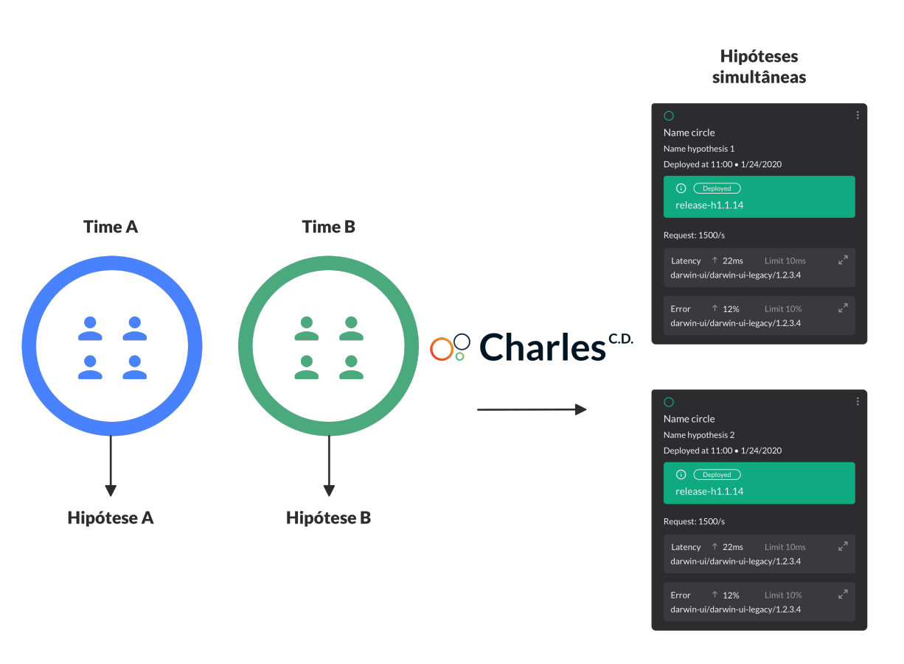
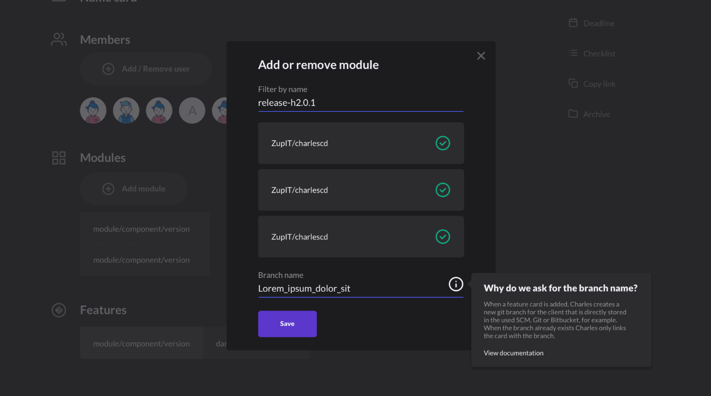
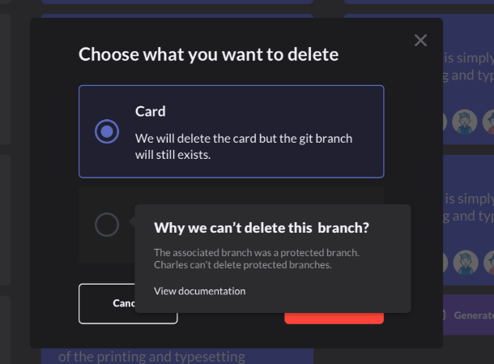
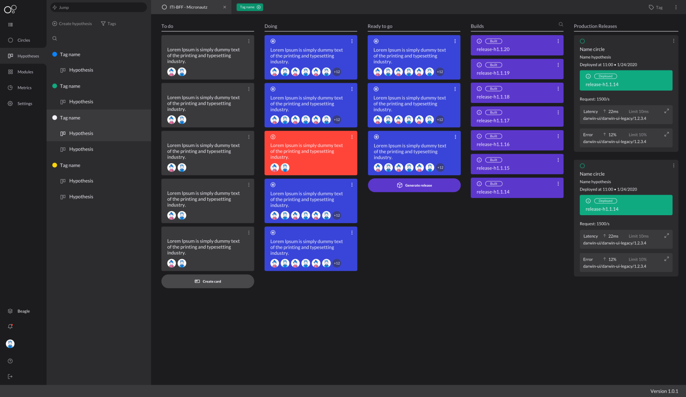

# Hipótese

As hipóteses são as alternativas cadastradas na plataforma para resolver algum problema ou validar mudanças nas aplicações que você integrou ao Charles. 

É possível que uma hipótese contenha uma ou mais features, e elas estão relacionadas diretamente aos módulos que foram cadastrados anteriormente no seu workspace.

Imagine uma situação na qual duas equipes trabalham no mesmo produto e têm ideias diferentes para aumentar a taxa de conversão de clientes. A equipe A sugere adicionar um botão na página, enquanto a equipe B acredita que incluir um box de "_sugestão de venda_" será mais assertivo.

Dessa forma, o Charles possibilita que as duas equipes criem duas hipóteses distintas. Assim, cada uma, poderá conduzir o desenvolvimento através de um board gerado automaticamente. A partir disso, cada equipe poderá selecionar de forma independente, os círculos com usuários distintos para validar os resultados de cada uma das hipóteses.

## Como criar hipóteses?

Ao cadastrar uma hipótese dentro do Charles, a sua requisição será encaminhada ao `charlescd-moove`. Ao final desse processo, o sistema irá gerar automaticamente um quadro \(board\) no qual é possível criar e gerenciar cartões com as releases e as ações necessárias para testar as hipóteses levantadas.

Esses cartões podem ser de dois tipos:

1. **Feature:** são os cartões que envolvem codificação, como a implementação de novas funcionalidades \(features\) ou ajustes em partes do projeto. 
2. **Action:** são os cartões que indicam uma ação a ser feita, como, por exemplo, realizar um teste de campo com os usuários. 

Quando um cartão de feature é adicionado, o Charles cria uma nova branch no git do cliente que, por sua vez, é armazenada diretamente no SCM utilizado, seja ele Git ou Bitbucket. 

O nome da branch é escolhido pelo usuário por meio do campo **Branch name**, veja abaixo:

## Branches Protegidas

Quando você excluir ou alterar um cartão do tipo **feature** para o tipo **action,** a branch associada pode ser excluída. 

Se a branch já existir, ela é associada somente ao cartão.

Para evitar exclusões indevidas de branches, o Charles permite a configuração de **branches protegidas**. Essas branches não podem ser excluídas pelo Charles. 

### Excluindo um Cartão

Se você excluir um cartão ou alterar um cartão de feature para o de action e  a branch associada se encontrar na lista de branches protegidas; a exclusão da branch será ignorada.

Existem 3 opções de de exclusão de cartão:

### Configuração 

1. **Arquivar:** Somente desabilita o cartão;
2. **Excluir card:** Exclui somente o card;
3. **Excluir card e branch:** Exclui o card e a branch associada a ele.

A configuração é realizada por meio da propriedade de ambiente `charlescd.protected.branches`no módulo `moove`. O valor padrão dela é **master**, **main** e **trunk**.

## Branches Protegidas

## Gestão do Board

Quando você excluir ou alterar um cartão do tipo **feature** para o tipo **action,** a branch associada pode ser excluída. 

Para evitar exclusões indevidas de branches, o Charles permite a configuração de **branches protegidas**. Essas branches não podem ser excluídas pelo Charles. 

Se você alterar um cartão de feature para o de action e se a branch associada se encontrar na lista de branches protegidas, a exclusão será ignorada.

Caso você exclua um cartão cuja branch associada estiver configurada como protegida, ao ir para opção de exclusão de cartão, perceberá que a branch virá desabilitada. Veja como na imagem abaixo:

### Configuração

A configuração é realizada por meio da propriedade de ambiente `charlescd.protected.branches`no módulo `moove`. O valor padrão dela é **master**, **main** e **trunk**.

## Gestão do Board

Organizado com base em conceitos da metodologia ágil, o Board é estruturado para que, a partir de tarefas do backlog, você possa priorizar o que será feito \(to do\) e indicar o que está em andamento \(doing\).

A medida que o desenvolvimento da hipótese evolui, as tarefas são movidas para a próxima coluna. Os status de cada atividade são:

* **To Do:** as tarefas foram priorizadas e precisam ser feitas.
* **Doing:** as tarefas estão em andamento.
* **Ready to go:** as atividades finalizadas. Caso seja do tipo feature card, é possível gerar um build.
* **Builds:** aqui estão representados todos os builds gerados a partir da combinação de feature nos cartões da coluna anterior \(Ready to go\). É possível expandir o cartão para ter mais informações.

O Charles é responsável pela orquestração da resolução dos merges, principalmente caso surjam vários cartões que envolvam módulos iguais, porém com ramificações diferentes no git.

Depois que esse processo termina e todos os códigos são mesclados, uma nova ramificação de release é criada e o estado do cartão é alterado para **build**.

* **Releases Deployed:** os cartões nessa coluna mostram de onde estão implantados os builds da hipótese.

Quando uma hipótese é movida para coluna **Ready To Go**, você indica ao sistema que aquele cartão pode passar pelo processo de **Generate Release Candidate**, ou seja, a hipótese se transformará em uma release branch da release master presente no seu git.

