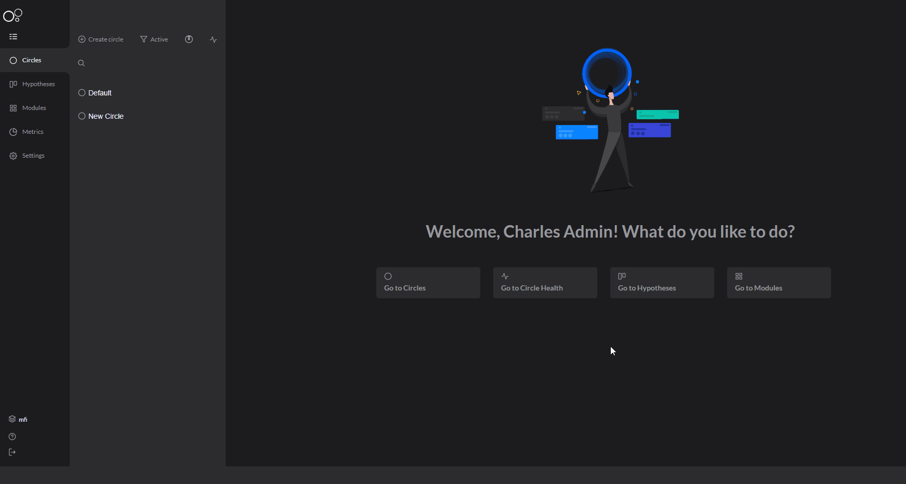
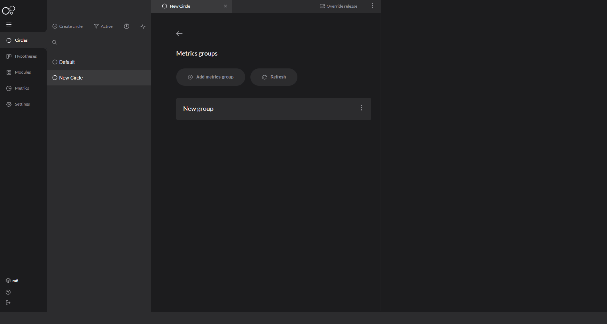
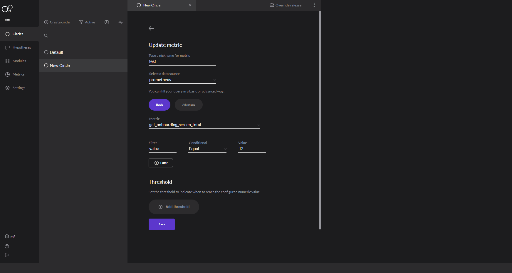
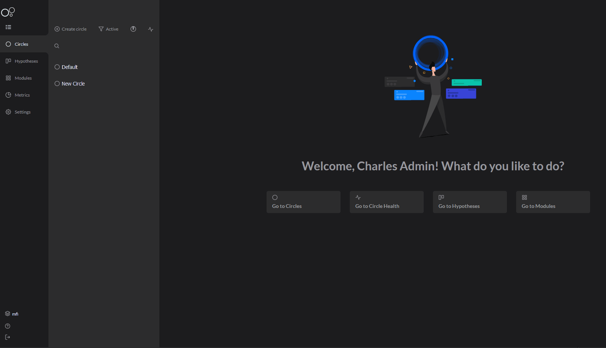
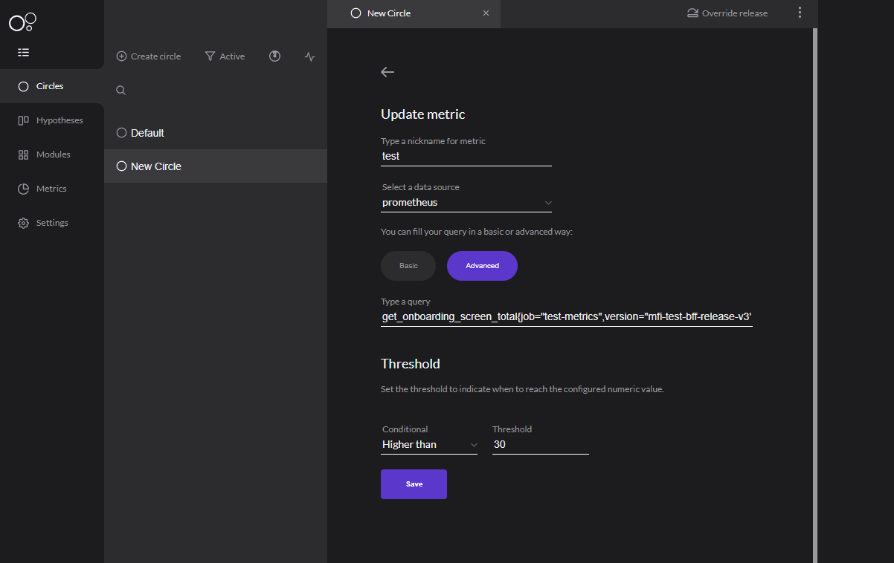

# Grupo de métricas

O grupo de métricas é uma funcionalidade que permite você cadastrar e organizar em grupos qualquer tipo de métrica dentro da sua aplicação. Essas métricas são relacionadas com o [**provedor que você cadastrou anteriormente**](provedor-metrica.md). 

### Como criar um grupo?

Para criar o seu grupo de métricas, siga os passos abaixo:

1. Em **Add metrics group,** digite o nome que desejar para o seu grupo e clique em **add group**. 

Depois que você criou seu grupo, agora você pode cadastrar a sua métrica:

   ****2**.** Clique em **Add metric** e coloque o nome da métrica que você deseja;

  3. Em **select a data source**, ****selecione o seu provedor de métrica já cadastrado;

 4. **Metric** é o campo onde o seu provedor irá retornar as métricas que já existem. Escolha uma e, depois disso, utilize o **Filter** para customizar com o valor e a condicional que você precisa. 

Veja abaixo: 

5.  Feito isso, defina um **Threshold** para estabelecer um limite para sua métrica. 

Por exemplo, se você quiser saber quando sua aplicação atingir um limite de 50 erros, basta customizar o **threshold**  para que você seja informado de quando essa métrica for atingida. 


Pronto! Você cadastrou seu grupo de métricas. 


Agora acompanhe o resultado com os gráficos e as informações disponíveis. 

### **Grupo de Métricas: Advanced** 

Há uma função **advanced** dentro do grupo. Aqui, você pode customizar sua própria métrica, como por exemplo, uma query de banco de dados, ou ainda especificar de acordo com a sua necessidade.

Veja como no exemplo abaixo: __

\*\*\*\*

