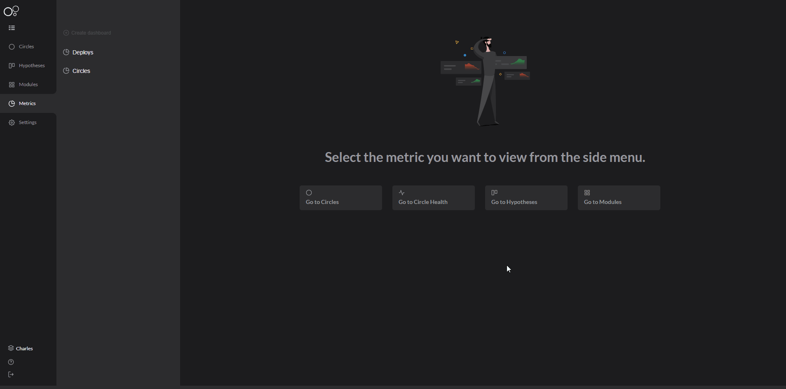

# Métricas do Charles

O Charles oferece métricas para você monitorar os deploys e os círculos. 

## Métrica de deploy

A métrica de deploy é uma funcionalidade que permite a visualização de um dashboard com as informações necessárias para você acompanhar os seus deployments,  como os números de ocorrências com sucessos ou erros e o tempo médio de implantação.

Há também outras informações disponíveis, como: 

* O nome da release usada;
* O círculo escolhido;
* A data e a duração do deploy;
* O responsável pelo deploy;
* Casos de undeploy;
* Módulos, componentes e versões utilizados;
* Status do deploy: Deployed, Deploying, Error, Undeployed e Undeploying.

Veja o exemplo abaixo: 

## Métrica de círculos 

É um gerenciador que facilita a visualização e o acompanhamento de informações técnicas sobre seus círculos.

Com as métricas de círculo você pode ter uma visão geral sobre o seus círculos no Charles, como:

* Os círculos [**ativos e inativos**](../circulo.md#circulos-ativos-e-inativos);
* Tempo de vida do círculo;
* A data da última atualização;

Veja abaixo:

