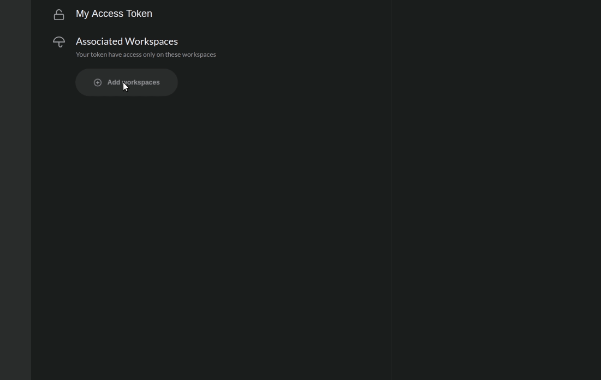
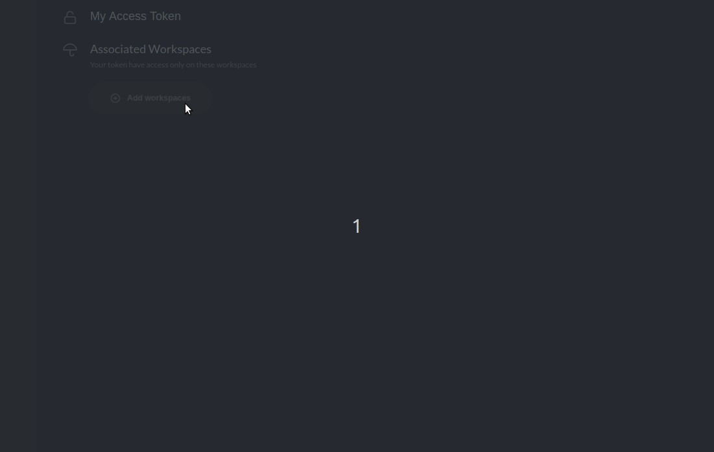
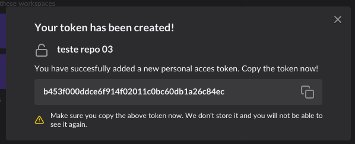
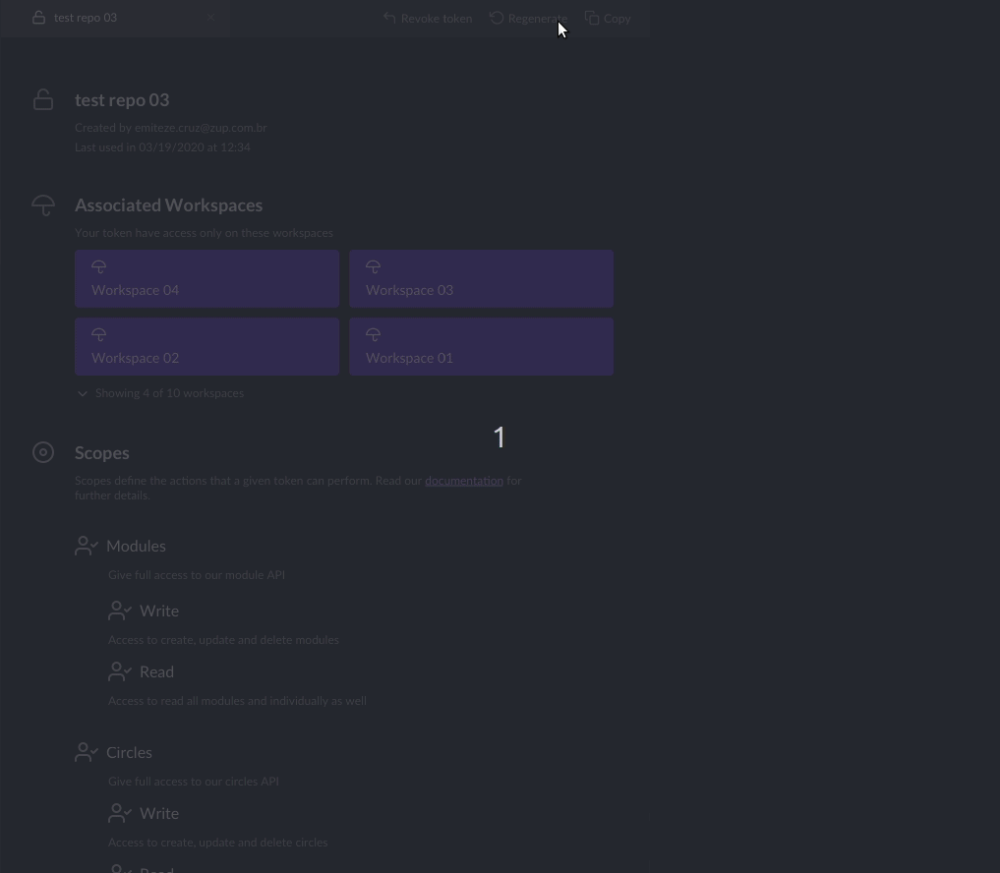

# Token Sistêmico

## O que é?

Um token sistêmico é uma cadeia de caracteres opaca que identifica um usuário \(ou aplicação\). Ele pode ser utilizado por integrações para realizar chamadas nas APIs internas do Charles C.D. 


Se você deseja integrar o Charles ao seu pipeline de deployment, **você irá precisar de um token sistêmico** **com permissionamento** para executar as ações.


Quando você acessar o Charles com o perfil de root,  o item **"System Token"** aparecerá no menu inicial**.** Essa é a área gerencial dos tokens, onde você pode criar novos tokens, visualizar todos existentes, revogar e recriar.

## Como criar?

Para criar um token sistêmico, você precisa preencher três informações:

1. O **nome** que identificará o token;
2. Os **workspaces** que ele terá acesso;
3. Quais os **escopos de permissionamento** o token poderá atuar dentro dos workspaces.

### Workspaces

Para selecionar os workspaces, você terá duas opções:

* Permitir que o token tenha acesso a todos os worskspaces:

* Selecionar workspaces específicos:

### Escopos

Os escopos definem quais as ações um token pode desempenhar.  Você pode criar o seu token com um ou mais escopos. Para fazer isso, escolha entre as opções abaixo: 

* **Módulos:** acesso completo \(_leitura e escrita_\) as APIs referentes aos módulos.
  * **Escrita**: acesso para criar, atualizar e deletar módulos. 
  * **Leitura**: acesso de leitura a todos os módulos.
* **Círculos**: acesso completo \(_leitura e escrita_\) as APIs referentes aos círculos.
  * **Escrita**: acesso para criar, atualizar e deletar círculos. 
  * **Leitura**: acesso de leitura a todos os círculos.
* **Deploy:** acesso completo \(_leitura e escrita_\) à implantação de releases nos círculos.
* **Manutenção:** acesso completo \(_leitura e escrita_\) as configurações dos workspaces.

## Como copiar um token?

Depois de finalizar o processo de personalização do seu token, **não se esqueça de copiá-lo**. Não é possível copiar esse token novamente. 

## Como revogar um token?

Para anular as permissões de um token, é só revogá-lo. Veja abaixo como fazer isso: 

* Acesse o menu de visualização do token;
* Selecione o token;
* Clique na opção **`Revoke Token`**.

## Como gerar um token novamente?

Se você perdeu o valor do seu token, é possível recriá-lo com todas as permissões já existentes. Quando você faz isso, o valor anterior é cancelado e o novo valor é o único válido. Veja o exemplo abaixo: 

1. No menu superior, clique em "**Regenerate**"
2. Confirme a ação no botão "**Yes, regenerate token.**" em pop-up que irá aparecer.
3. Pronto! Um novo valor será gerado. 

